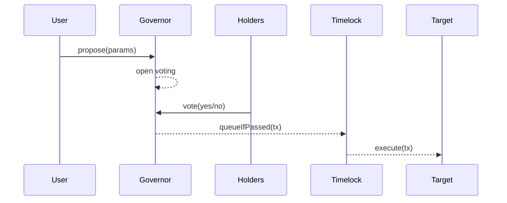
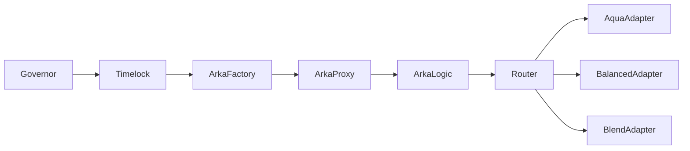
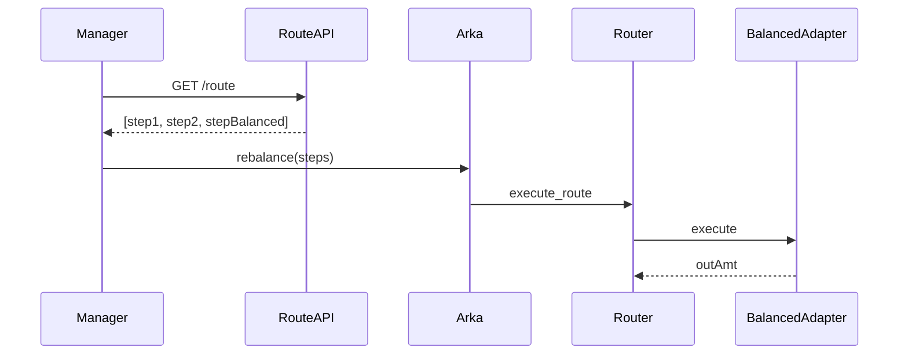

# Arka.fund – Arquitectura Técnica Detallada

**Versión:** 1.0 • **Actualización:** 2025‑04‑30

---

## I. Introducción y Alcance Funcional

Este documento describe en detalle la arquitectura técnica de Arka.fund, abarcando:

1. **Descripción funcional** (casos de uso, roles, flujos operativos).
2. **Componentes on-chain** (contratos Soroban: Factory, Arkas, Router, Adapters, DAO).
3. **Integración DeFi** (AMMs: Aquarius, SoroSwap, Phoenix, Comet, Balanced; Lending/Borrowing: Blend).
4. **Gobernanza DAO** (módulos, propuestas, timelock, distribución de fees).
5. **Sistema de niveles de managers** (tiers basados en AUM y profit neto).
6. **Servicios off-chain** (Route API, indexador, front-end, backtesting, monitorización).
7. **Diagramas y esquemas** (Mermaid + explicaciones detalladas).

---

## II. Descripción Funcional

### 1. Roles y Casos de Uso
| Rol        | Privilegios                                                | Ejemplo de flujo                           |
|------------|------------------------------------------------------------|--------------------------------------------|
| Manager    | Crear arkas, configurar parámetros, rebalancear activos, proponer DAO | José crea un arka USD-Stellar con fees 2% y whitelist USDC.
| Depositor  | Depositar, redimir shares, consultar rendimiento, votar DAO  | Ana deposita 1,000 USDC, ve su NAV y recibe tokens.
| Voter      | Proponer/votar cambios (assets, fees, integrations), reclamar rewards DAO | María propone añadir BTC a whitelist y vota.

### 2. Flujos Principales

#### a) Creación de Arka
```mermaid
sequenceDiagram
auth->>Factory: createArka(params)
Factory->>ArkaProxy: deploy Proxy + Logic
ArkaProxy->>Logic: initialize({
  denomination_asset, fees, whitelist, limits, manager
})
Logic-->>ArkaProxy: OK
ArkaProxy-->>Factory: arkaAddress
Factory-->>auth: created(arkaAddress)
```
- El **manager** al inicializar el arka especifica el **denomination_asset** (unidad de cuenta para NAV, fees y reporting), junto a fees, whitelist de assets, límites de depósito/retiro y reglas de governance.

#### b) Depósito y Redención
```mermaid
sequenceDiagram
User->>Arka: deposit(asset, amount)
Arka->>AssetContract: transferFrom(user, arka, amount)
Arka->>ArkaToken: mint(user, shares)
Arka-->>User: event Deposit(shares)

User->>Arka: redeem(shares)
Arka->>ArkaToken: burn(user, shares)
Note right of Arka: Calcula X% de cada asset subyacente
en base a los shares quemados
Arka->>Router: execute swaps internos
Note right of Router: Convierte cada asset al denomination_asset
en pasos atomizados
Arka->>AssetContract: transfer(user, totalDenominationAsset)
Arka-->>User: event Redeem(amountReturned)
```
- **Deposit**: recibe asset permitido y emite shares proporcionales calculadas en base al denomination_asset.
- **Redeem**: quema shares y, antes de transferir fondos, **ejecuta swaps internos** para convertir **la proporción correspondiente de cada asset subyacente** al `denomination_asset`. Finalmente transfiere al usuario el **capital original** más la **ganancia neta** acumulada.

---

## III. Componentes On-chain

### 1. ArkaFactory
- **Funciones:**
  - `createArka(params) -> Address`: despliega un Proxy apuntando a la implementación de ArkaLogic.
  - `upgradeImplementation(newImpl)`: interno, solo vía Timelock.
- **Estado:** almacena la implementación actual y dirección del proxy template.

### 2. ArkaProxy & ArkaLogic
- **Proxy:** delega todas las llamadas a ArkaLogic.
- **Logic (Rust/Soroban):**
  - **Storage**:
    - `denomination: Asset`  
    - `totalShares: i128`  
    - `aum: i128`  
    - `fees: FeeStructure { mgmtRate, perfRate, depositRate, redeemRate }`  
    - `whitelist: Vec<Asset>`  
    - `manager: Address`  
  - **Entradas**:
    - `deposit(asset: Asset, amt: i128)`  
    - `redeem(shares: i128)`  
    - `rebalance(steps: Vec<SwapStep>)`  
  - **Eventos**:
    - `Deposit(user, asset, amt, shares)`  
    - `Redeem(user, shares, assetAmt)`  
    - `ProfitLogged(delta, timestamp)`

### 3. ArkaToken (token contract)
- SPL-20 style con `mint`, `burn`, `transfer`.
- `approve`/`transferFrom` para integrarse con front-end/redeem.

### 4. Router y Adapters
- El `Router` orquesta swaps multi-hop recibiendo un vector de *SwapStep*.
- Cada *SwapStep* define: `adapter_id`, `pool_id`, `amt_in`, `min_out`, `asset_out`.
- **Adapters**: implementan el `Trait Adapter { validate(env, &step) -> Result<()>; execute(env, &step, amount_in) -> Result<i128>; }`.

**Protocolo integrados:**
| Protocolo           | Tipo      | Operaciones clave                    |
|---------------------|-----------|--------------------------------------|
| **Aquarius AMM**    | AMM       | `swap`, `add_liquidity`, `remove_liquidity` |
| **SoroSwap AMM**    | AMM       | `swap`, `add_liquidity`, `remove_liquidity` |
| **Phoenix AMM**     | AMM       | `swap`, `deposit`, `withdraw`       |
| **Comet AMM**       | AMM       | `swap`, `mint_liquidity`, `burn_liquidity` |
| **Balanced AMM**    | AMM       | `swap`, `pool_reserves`              |
| **Blend**           | Lending   | `lend`, `borrow`, `repay`, `liquidate` |

> Todos los AMMs y Blend tienen la misma relevancia; no hay un protagonismo especial por protocolo.

##### Ejemplo genérico de Adapter
```rust
pub struct GenericAdapter;

impl Adapter for GenericAdapter {
    fn validate(env: &Env, step: &SwapStep) -> Result<(), AdapterError> {
        // Ejemplo: comprobación de reservas
        let (r0,r1) = protocol::reserves(env, step.pool_id);
        if r0 == 0 || r1 == 0 {
            return Err(AdapterError::NoLiquidity);
        }
        Ok(())
    }

    fn execute(env: &Env, step: &SwapStep, amount_in: i128) -> Result<i128, AdapterError> {
        // Ejemplo de llamada a swap genérico
        protocol::swap(env, step.pool_id, amount_in, step.min_out,
                       env.current_contract_address(),
                       env.current_contract_address());
        // Calcular output
        let balance = env.account_balance(env.current_contract_address(), step.asset_out)?;
        Ok(balance)
    }
}
```

---

## IV. Gobernanza DAO

### 1. Módulos
- **Governor:** creación y votación de propuestas (thresholds, quorums).  
- **Timelock:** delay configurable (ej. 48h) antes de ejecutar cambios.  
- **Treasury:** recibe fees (management, performance) y distribuye revenue share.

### 2. Flujos de Propuesta


### 3. Actualizaciones On-chain
- Assets whitelist, fees, adapters list, AUM limits.
- Implementación de contracts (ArkaLogic) upgradeable.

---

## V. Servicios Off-chain

### 1. Route-API (StellarBroker)
- Calcula rutas multi-hop que pueden incluir AMMs (Aquarius, SoroSwap, Phoenix, Comet, Balanced) y Blend.
- Endpoint `GET /route?from=&to=&amt=` → JSON con pasos (`SwapStep[]`).

### 2. Indexer & APIs
- Escucha eventos on-chain (`Deposit`, `Redeem`, `ProfitLogged`, `SwapExecuted`).
- Almacena en **DynamoDB** para consultas de estado y métricas.
- Expone API GraphQL para front-end (histórico de transacciones, balances, rendimiento).

### 3. Front-end (React + Tailwind)
- Páginas: Discover, Arka Detail (Performance, Portfolio, My Positions, Activity, Deposits, Withdrawals, Stats), Governance.
- Usa GraphQL e invoca transacciones Soroban con `soroban-client`.

### 4. Monitorización
- Alertas de eventos críticos: grandes rebalanceos, fallos de ejecución, proposals near expiry.

---

## VI. Diagramas de Arquitectura

### 1. Diagrama de despliegue


### 2. Flujo de Swaps


---

## VII. Seguridad y Buenas Prácticas
- **Slippage Checks**: `min_out` verificado en adapter.  
- **Timelock** asegura revisión de cambios.  
- **Testing exhaustivo**: unit, integration, property tests para swaps y proposals.
- **Audit Trails**: todos los eventos registrados y auditable.

---

## VIII. Despliegue y CI/CD
- **Pipelines**: `cargo fmt`, `cargo clippy`, `cargo test`, `soroban testnet deploy`, e2e tests, auditoría estática.  
- **Versionado**: SemVer para contratos y adapters.  
- **Rollback**: mantención de implementaciones previas en ArkaFactory.

---

*Documento preparado por el equipo técnico de Arka.fund. Mantener bajo control de versiones.*


